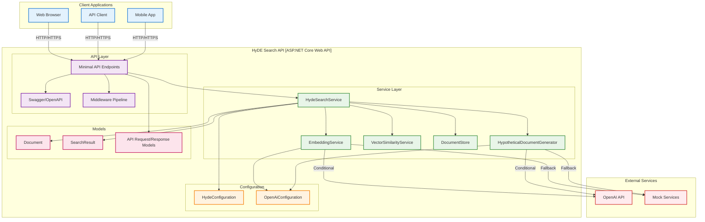

# HyDE Search API - Architecture Overview

## System Architecture

The HyDE Search API is built using ASP.NET Core minimal APIs with a clean architecture pattern. Here's the complete architectural documentation:

## C4 Component Model



## Key Design Principles

### 1. Dependency Injection
- All services are registered in the DI container
- Interfaces enable testability and flexibility
- Configuration options pattern for settings

### 2. Service Abstraction
- `IEmbeddingService` - Abstracts embedding generation
- `IHypotheticalDocumentGenerator` - Abstracts document generation
- `IVectorSimilarityService` - Handles similarity calculations
- `IDocumentStore` - Manages document persistence
- `IHydeSearchService` - Orchestrates search operations

### 3. Configuration-Driven
- OpenAI services used when API key is configured
- Mock services used for development/testing
- Configurable weights and thresholds

### 4. Modern C# Patterns
- File-scoped namespaces
- Nullable reference types
- Record types for immutable data
- Async/await throughout
- Minimal APIs for endpoints

## Service Responsibilities

### HydeSearchService
- Orchestrates the complete search workflow
- Combines traditional and hypothetical document similarities
- Manages document indexing with embedding generation
- Implements weighted scoring algorithm

### EmbeddingService
- Generates vector embeddings from text
- Supports both OpenAI API and mock implementations
- Handles batch embedding generation for efficiency

### HypotheticalDocumentGenerator
- Creates hypothetical documents that would answer queries
- Uses OpenAI GPT models or deterministic mock responses
- Applies configurable prompt templates

### VectorSimilarityService
- Calculates cosine similarity between vectors
- Uses System.Numerics.Tensors for performance
- Handles high-dimensional vector operations

### DocumentStore
- In-memory storage for documents and embeddings
- Thread-safe operations with concurrent collections
- Supports bulk operations for efficiency

## API Design

### RESTful Endpoints
- Clear, resource-based URLs
- Appropriate HTTP methods and status codes
- Consistent request/response models
- Comprehensive error handling

### OpenAPI Documentation
- Swagger UI for interactive testing
- Detailed endpoint descriptions
- Request/response schema documentation
- Example payloads

## Configuration Options

### HyDE Algorithm Parameters
```json
{
  "HyDE": {
    "HydeWeight": 0.7,
    "TraditionalWeight": 0.3,
    "MaxResults": 10,
    "SimilarityThreshold": 0.1,
    "HydePromptTemplate": "Write a passage that would answer this question: {query}\n\nPassage:"
  }
}
```

### OpenAI Integration
```json
{
  "OpenAI": {
    "ApiKey": "your-api-key",
    "BaseUrl": "https://api.openai.com/v1",
    "EmbeddingModel": "text-embedding-3-small",
    "CompletionModel": "gpt-4o-mini",
    "MaxTokens": 1000,
    "Temperature": 0.7
  }
}
```

## Technology Stack

- **Framework**: ASP.NET Core 9.0
- **API Style**: Minimal APIs
- **Documentation**: Swagger/OpenAPI
- **DI Container**: Microsoft.Extensions.DependencyInjection
- **Logging**: Microsoft.Extensions.Logging
- **Configuration**: Microsoft.Extensions.Configuration
- **Vector Operations**: System.Numerics.Tensors
- **HTTP Client**: System.Net.Http
- **Serialization**: System.Text.Json

## Deployment Considerations

### .NET Aspire Ready
- Project structure supports Aspire orchestration
- Service defaults can be easily added
- Ready for containerization and cloud deployment

### Scalability
- Stateless service design
- In-memory storage can be replaced with distributed cache
- Async operations throughout for better throughput

### Observability
- Structured logging with correlation IDs
- Performance metrics tracked
- Health check endpoint available

## Future Enhancements

1. **Persistent Storage**: Replace in-memory store with database
2. **Caching**: Add Redis for embedding and result caching
3. **Batch Processing**: Queue-based document indexing
4. **Authentication**: Add JWT or API key authentication
5. **Rate Limiting**: Implement request throttling
6. **Monitoring**: Add application insights and metrics
7. **Vector Database**: Integrate with specialized vector databases
8. **Search Analytics**: Track search patterns and performance
