# HyDE Search API Workflow Documentation

## Overview
This document provides a detailed workflow diagram for the HyDE (Hypothetical Document Embeddings) Search API, showing the complete process from API request to response.

## HyDE Search Algorithm Workflow

The following Mermaid diagram illustrates the complete workflow of the HyDE search process:

```mermaid
graph TD
    %% Client Request
    A[🌐 Client sends POST /api/search] --> B{📋 Validate Request}
    B -->|❌ Invalid| C[🚨 Return 400 Bad Request]
    B -->|✅ Valid| D[📝 Extract Query String]
    
    %% Document Retrieval
    D --> E[🗄️ Get All Documents from Store]
    E --> F{📊 Documents Available?}
    F -->|❌ No| G[⚠️ Return Empty Results]
    F -->|✅ Yes| H[🚀 Start HyDE Search Process]
    
    %% Traditional Embedding Path
    H --> I[🔤 Generate Query Embedding]
    I --> J[📡 Call Embedding Service]
    J --> K[🧮 Receive Query Vector]
    
    %% Hypothetical Document Path
    H --> L[🤖 Generate Hypothetical Document]
    L --> M[💭 Call HyDE Generator Service]
    M --> N[📝 Receive Hypothetical Text]
    N --> O[🔤 Generate HyDE Embedding]
    O --> P[📡 Call Embedding Service Again]
    P --> Q[🧮 Receive HyDE Vector]
    
    %% Similarity Calculations
    K --> R[🔄 For Each Document in Store]
    Q --> R
    R --> S{🧮 Document has Embedding?}
    S -->|❌ No| T[⚠️ Skip Document & Log Warning]
    S -->|✅ Yes| U[📊 Calculate Traditional Similarity]
    
    U --> V[📏 Cosine Similarity: Query ↔ Document]
    V --> W[📊 Calculate HyDE Similarity]
    W --> X[📏 Cosine Similarity: HyDE ↔ Document]
    
    %% Score Combination
    X --> Y[⚖️ Combine Similarities]
    Y --> Z[🧮 Combined = Traditional×0.3 + HyDE×0.7]
    Z --> AA{🎯 Above Threshold?}
    AA -->|❌ Below 0.1| AB[❌ Discard Result]
    AA -->|✅ Above 0.1| AC[✅ Add to Results]
    
    %% Continue Loop
    T --> AD{🔄 More Documents?}
    AB --> AD
    AC --> AD
    AD -->|✅ Yes| R
    AD -->|❌ No| AE[📈 Sort Results by Similarity]
    
    %% Final Processing
    AE --> AF[🔟 Take Top 10 Results]
    AF --> AG[📦 Create Search Response]
    AG --> AH[⏱️ Calculate Execution Time]
    AH --> AI[📤 Return Results to Client]
    
    %% Error Handling
    AI --> AJ[✅ Success Response 200]
    J -->|❌ Error| AK[🚨 Embedding Service Error]
    M -->|❌ Error| AL[🚨 HyDE Generator Error]
    AK --> AM[📤 Return 500 Internal Error]
    AL --> AM
    
    %% Styling
    classDef clientNode fill:#e1f5fe,stroke:#01579b,stroke-width:2px
    classDef processNode fill:#f3e5f5,stroke:#4a148c,stroke-width:2px
    classDef serviceNode fill:#e8f5e8,stroke:#1b5e20,stroke-width:2px
    classDef errorNode fill:#ffebee,stroke:#b71c1c,stroke-width:2px
    classDef decisionNode fill:#fff3e0,stroke:#e65100,stroke-width:2px
    
    class A,AI,AJ clientNode
    class I,J,K,L,M,N,O,P,Q,U,V,W,X,Y,Z serviceNode
    class B,F,S,AA,AD decisionNode
    class C,G,T,AB,AK,AL,AM errorNode
    class D,E,H,R,AC,AE,AF,AG,AH processNode
```

## Document Indexing Workflow

The following diagram shows how documents are indexed in the system:

```mermaid
graph TD
    A[🌐 Client sends POST /api/documents] --> B{📋 Validate Documents Array}
    B -->|❌ Empty/Null| C[🚨 Return 400 Bad Request]
    B -->|✅ Valid| D[🔄 Process Each Document]
    
    D --> E{🧮 Document has Embedding?}
    E -->|✅ Yes| F[✅ Document Ready]
    E -->|❌ No| G[🔤 Generate Embedding]
    G --> H[📡 Call Embedding Service]
    H --> I[🧮 Attach Embedding to Document]
    
    F --> J[🗄️ Store Document in Index]
    I --> J
    J --> K{🔄 More Documents?}
    K -->|✅ Yes| D
    K -->|❌ No| L[📊 Count Total Documents]
    L --> M[📤 Return Success Response]
    
    %% Error Handling
    H -->|❌ Error| N[🚨 Embedding Generation Failed]
    N --> O[📤 Return 500 Internal Error]
    
    %% Styling
    classDef clientNode fill:#e1f5fe,stroke:#01579b,stroke-width:2px
    classDef processNode fill:#f3e5f5,stroke:#4a148c,stroke-width:2px
    classDef serviceNode fill:#e8f5e8,stroke:#1b5e20,stroke-width:2px
    classDef errorNode fill:#ffebee,stroke:#b71c1c,stroke-width:2px
    classDef decisionNode fill:#fff3e0,stroke:#e65100,stroke-width:2px
    
    class A,M clientNode
    class G,H,I,J,L serviceNode
    class B,E,K decisionNode
    class C,N,O errorNode
    class D,F processNode
```

## Configuration & Weights

The HyDE algorithm uses the following default configuration:

- **Traditional Weight**: 0.3 (30% of final score)
- **HyDE Weight**: 0.7 (70% of final score)
- **Similarity Threshold**: 0.1 (minimum score to include result)
- **Max Results**: 10 (maximum results returned)

## API Endpoints Summary

| Endpoint | Method | Purpose | 
|----------|--------|---------|
| `/` | GET | API information and available endpoints |
| `/api/health` | GET | Health check endpoint |
| `/api/documents` | GET | Get count of indexed documents |
| `/api/documents` | POST | Index new documents with embeddings |
| `/api/search` | POST | Perform HyDE search with detailed results |
| `/api/search/quick` | GET | Quick search with query parameter |

## Service Architecture

The HyDE search system uses the following services:

1. **IEmbeddingService**: Generates vector embeddings (OpenAI or Mock)
2. **IHypotheticalDocumentGenerator**: Creates hypothetical documents (OpenAI or Mock)
3. **IVectorSimilarityService**: Calculates cosine similarity between vectors
4. **IDocumentStore**: Manages document storage and retrieval
5. **IHydeSearchService**: Orchestrates the complete search process

## Performance Considerations

- Embeddings are generated asynchronously
- Documents without embeddings are skipped with warnings
- Results are sorted by combined similarity score
- Execution time is tracked and returned in response
- Memory-based document store for fast retrieval

## Error Handling

The system includes comprehensive error handling for:
- Invalid API requests (400 Bad Request)
- Empty document stores (empty results)
- Missing embeddings (logged warnings)
- Service failures (500 Internal Server Error)
- Network timeouts and API failures
