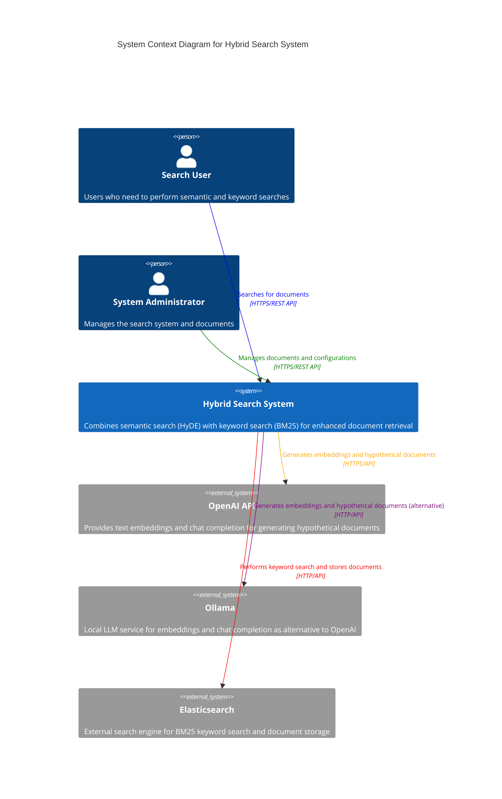
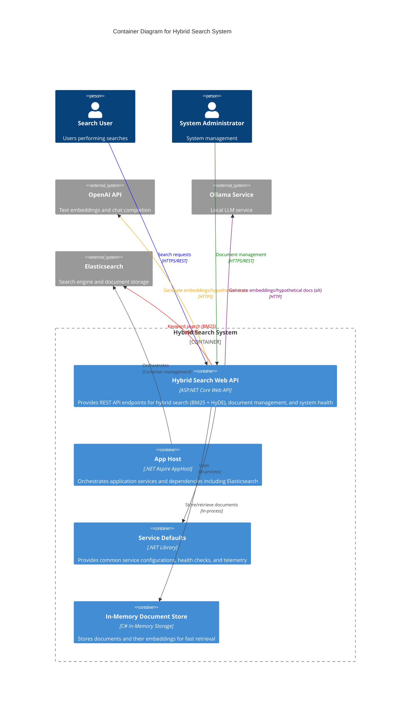

# C4 Architecture Diagrams for Hybrid Search Project

This document contains C4 model diagrams (Context, Container, and Component) for the Hybrid Search project using Mermaid format.

## Context Diagram (Level 1)

Shows the high-level system context and external dependencies.

## Container Diagram (Level 2)

Shows the main containers and their interactions within the Hybrid Search system.

## Component Diagram (Level 3)

Shows the internal components of the Hybrid Search Web API container.

```mermaid
C4Component
    title Component Diagram for Hybrid Search Web API

    Person(user, "Search User")
    
    Container_Boundary(webApi, "Hybrid Search Web API") {
        Component(endpoints, "REST API Endpoints", "ASP.NET Core Minimal APIs", "Handles HTTP requests for hybrid search, HyDE-only search, document management, and health checks")
        Component(hybridService, "Hybrid Search Service", "C# Service Class", "Orchestrates hybrid search combining BM25 keyword search with HyDE semantic search using weighted scoring")
        Component(hydeService, "HyDE Search Service", "C# Service Class", "Implements HyDE algorithm: combines query embedding with hypothetical document similarity")
        Component(embeddingService, "Embedding Service", "C# Service Class", "Generates text embeddings using AI providers (OpenAI/Ollama via Semantic Kernel)")
        Component(hypoDocGen, "Hypothetical Document Generator", "C# Service Class", "Generates hypothetical documents that would answer queries using LLMs")
        Component(vectorSimilarity, "Vector Similarity Service", "C# Service Class", "Calculates cosine similarity between document embeddings using System.Numerics.Tensors")
        Component(bm25Service, "BM25 Service", "C# Service Class", "Implements BM25 keyword search algorithm for in-memory documents")
        Component(elasticBM25, "Elasticsearch BM25 Service", "C# Service Class", "Provides BM25 keyword search using Elasticsearch backend")
        Component(documentStore, "Document Store", "C# Service Class", "Manages document storage and retrieval with embedding caching")
        Component(config, "Configuration Services", "C# Configuration Classes", "Manages AI, HyDE, BM25, and Hybrid search configurations")
        Component(mockServices, "Mock Services", "C# Service Classes", "Provides mock implementations for testing without AI providers")
    }
    
    Container_Ext(docStorage, "In-Memory Document Store", "Document storage")
    System_Ext(openai, "OpenAI API")
    System_Ext(ollama, "Ollama Service") 
    System_Ext(elasticsearch, "Elasticsearch")
    
    Rel(user, endpoints, "HTTP requests", "HTTPS/REST")
    Rel(endpoints, hybridService, "Hybrid search requests")
    Rel(endpoints, hydeService, "HyDE-only search requests")
    Rel(endpoints, documentStore, "Document CRUD operations")
    
    Rel(hybridService, hydeService, "Get HyDE semantic scores")
    Rel(hybridService, bm25Service, "Get BM25 keyword scores (in-memory)")
    Rel(hybridService, elasticBM25, "Get BM25 keyword scores (Elasticsearch)")
    
    Rel(hydeService, embeddingService, "Generate query embedding")
    Rel(hydeService, hypoDocGen, "Generate hypothetical document")
    Rel(hydeService, vectorSimilarity, "Calculate similarities")
    Rel(hydeService, documentStore, "Retrieve documents")
    
    Rel(embeddingService, openai, "Generate embeddings", "HTTPS")
    Rel(embeddingService, ollama, "Generate embeddings (alt)", "HTTP")
    Rel(embeddingService, mockServices, "Mock embeddings (fallback)", "In-process")
    Rel(hypoDocGen, openai, "Generate hypothetical docs", "HTTPS")
    Rel(hypoDocGen, ollama, "Generate hypothetical docs (alt)", "HTTP")
    Rel(hypoDocGen, mockServices, "Mock hypothetical docs (fallback)", "In-process")
    
    Rel(bm25Service, docStorage, "Access documents")
    Rel(elasticBM25, elasticsearch, "BM25 queries", "HTTP")
    Rel(documentStore, docStorage, "Store/retrieve")
    
    Rel(endpoints, config, "Load configurations")
    Rel(hybridService, config, "Hybrid search settings")
    Rel(hydeService, config, "HyDE settings")
    Rel(embeddingService, config, "AI settings")
    
    UpdateRelStyle(user, endpoints, $textColor="blue", $lineColor="blue")
    UpdateRelStyle(embeddingService, openai, $textColor="orange", $lineColor="orange")
    UpdateRelStyle(embeddingService, ollama, $textColor="purple", $lineColor="purple")
    UpdateRelStyle(elasticBM25, elasticsearch, $textColor="red", $lineColor="red")
```

## Key Architectural Patterns

### Hybrid Search Strategy
1. **Parallel Execution**: BM25 keyword search and HyDE semantic search run concurrently
2. **Score Normalization**: Different scoring strategies (MinMax, ZScore, None) for combining results
3. **Weighted Combination**: Configurable weights for balancing keyword vs semantic relevance (default: 30% BM25, 70% HyDE)
4. **Unified Ranking**: Final results ranked by combined weighted scores with configurable thresholds

### HyDE Algorithm Implementation
1. **Query Processing**: User query received via REST API endpoints
2. **Dual Embedding Strategy**: Generate embeddings for both original query and hypothetical document
3. **Hypothetical Document Generation**: LLM creates a document that would answer the query
4. **Vector Similarity Calculation**: Cosine similarity between embeddings and stored documents using System.Numerics.Tensors
5. **Score Combination**: Weighted combination of query-to-document and hypothetical-to-document similarities

### API Endpoints Structure
- **`POST /api/search/hybrid`**: Primary hybrid search endpoint combining BM25 and HyDE
- **`POST /api/search`**: HyDE-only semantic search endpoint
- **`GET /api/search/quick`**: Quick hybrid search with query parameter
- **`POST /api/documents`**: Document indexing for both BM25 and HyDE search
- **`GET /api/documents`**: Document count and management
- **`GET /api/health`**: System health check

### AI Provider Flexibility
- **Multiple Backends**: Support for OpenAI and Ollama as AI providers via Semantic Kernel
- **Fallback Strategy**: Mock services when no AI provider is configured for development/testing
- **Service Abstraction**: Interface-based design (`IEmbeddingService`, `IHypotheticalDocumentGenerator`) allows easy provider switching
- **Configuration-Driven**: Provider selection based on configuration with automatic fallback detection

### Storage and Indexing Options
- **In-Memory Document Store**: Fast document storage with embedding caching for development/testing
- **Elasticsearch Integration**: Production-ready storage with advanced BM25 capabilities via NEST client
- **Hybrid Storage Strategy**: Semantic embeddings in-memory, keyword search via Elasticsearch
- **Automatic Indexing**: Documents automatically indexed for both search types on ingestion

### Configuration Management
- **Layered Configuration**: Support for appsettings.json, environment variables, and user secrets
- **Provider-Specific Settings**: Separate configuration sections for OpenAI, Ollama, BM25, and Hybrid search
- **Runtime Configuration**: Settings can be adjusted without code changes
- **Validation and Defaults**: Comprehensive default values with runtime validation

### Performance and Scalability
- **Async/Await Pattern**: All operations use async programming for better scalability
- **Cancellation Token Support**: Proper cancellation handling throughout the pipeline
- **Efficient Vector Operations**: System.Numerics.Tensors for high-performance similarity calculations
- **Connection Pooling**: Elasticsearch client with connection pooling and configuration optimization
