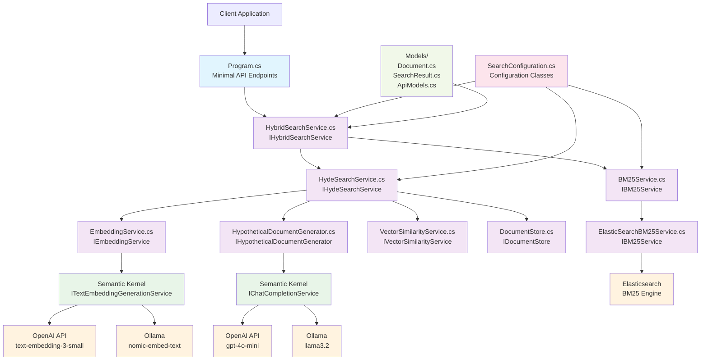
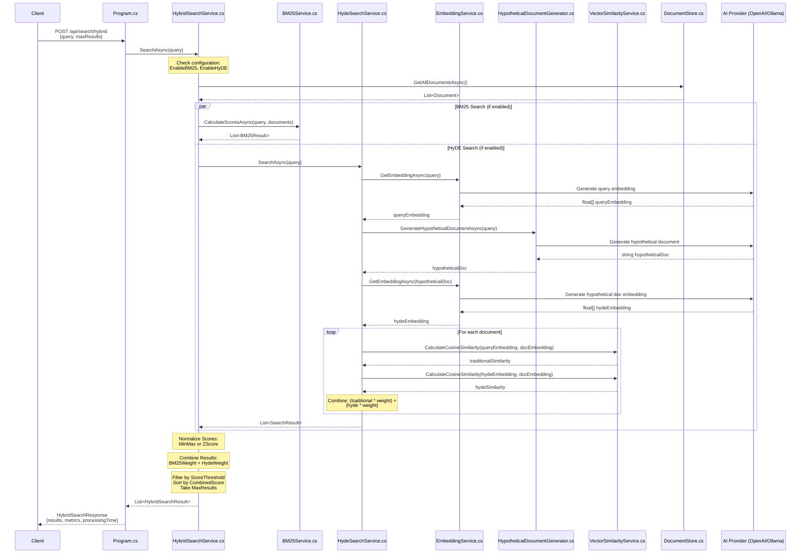
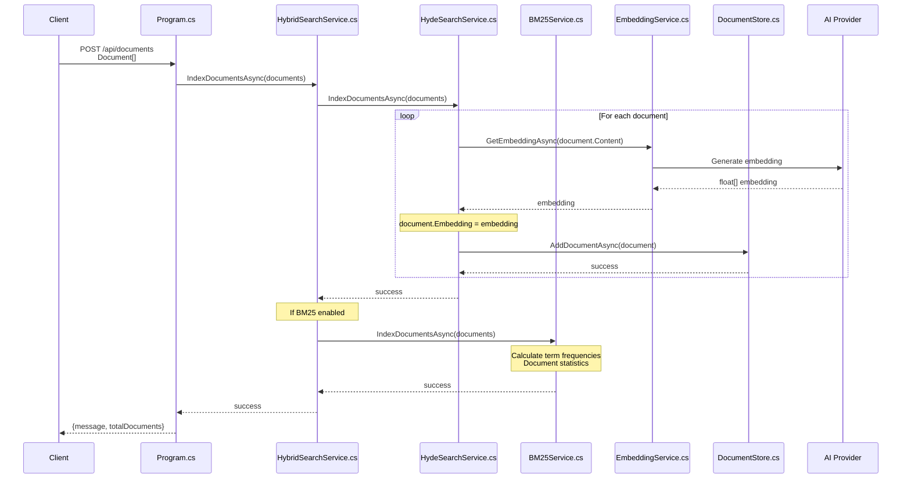

# Hybrid Search API Workflow

This document shows the complete workflow of the Hybrid Search API implemented in this project, combining BM25 keyword search with HyDE (Hypothetical Document Embeddings) semantic search.

## Architecture Overview

## Hybrid Search Request Flow

## Document Indexing Flow

## Component Responsibilities

### Core Services (.cs files)

| Component | File | Responsibility |
|-----------|------|----------------|
| **API Layer** | `Program.cs` | Minimal API endpoints, DI configuration, middleware setup |
| **Hybrid Search** | `HybridSearchService.cs` | Orchestrates BM25 + HyDE search, score normalization and combination |
| **HyDE Search** | `HydeSearchService.cs` | Implements HyDE algorithm, manages semantic search workflow |
| **BM25 Search** | `BM25Service.cs` | In-memory BM25 keyword search implementation |
| **Elasticsearch BM25** | `ElasticSearchBM25Service.cs` | Elasticsearch-based BM25 search implementation |
| **Embeddings** | `EmbeddingService.cs` | Text-to-vector conversion using AI models |
| **Hypothetical Docs** | `HypotheticalDocumentGenerator.cs` | Generates hypothetical documents from queries |
| **Vector Similarity** | `VectorSimilarityService.cs` | Cosine similarity calculations using System.Numerics.Tensors |
| **Document Store** | `DocumentStore.cs` | In-memory document storage with embeddings |

### Configuration

| Component | File | Purpose |
|-----------|------|---------|
| **Search Config** | `SearchConfiguration.cs` | AI providers, HyDE parameters, BM25 settings, hybrid weights |

### Models

| Component | File | Purpose |
|-----------|------|---------|
| **Core Models** | `Document.cs` | Document structure with embeddings |
| **Search Results** | `SearchResult.cs` | HyDE and Hybrid search result structures |
| **API Models** | `ApiModels.cs` | Request/response DTOs for API endpoints |

## Search Algorithms

### HyDE (Hypothetical Document Embeddings)
1. **Query Processing**: Generate embedding for original query
2. **Hypothetical Generation**: Create a hypothetical document that would answer the query
3. **Hypothetical Embedding**: Generate embedding for hypothetical document
4. **Similarity Calculation**: 
   - Traditional: query ↔ document similarity
   - HyDE: hypothetical document ↔ document similarity
5. **Score Combination**: Weighted average of traditional + HyDE similarities

### BM25 (Best Matching 25)
1. **Term Extraction**: Tokenize query and documents
2. **TF-IDF Calculation**: Term frequency with document frequency normalization
3. **BM25 Scoring**: Advanced TF-IDF with length normalization and saturation
4. **Ranking**: Sort documents by BM25 relevance score

### Hybrid Search
1. **Parallel Execution**: Run BM25 and HyDE searches simultaneously
2. **Score Normalization**: MinMax or Z-Score normalization of individual scores
3. **Weighted Combination**: Combine normalized scores using configurable weights
4. **Final Ranking**: Sort by combined score and apply threshold filtering

## Configuration Options

### Hybrid Search Settings
- **EnableBM25**: Toggle BM25 keyword search
- **EnableHyDE**: Toggle HyDE semantic search  
- **BM25Weight**: Weight for BM25 scores in combination (default: 0.4)
- **HydeWeight**: Weight for HyDE scores in combination (default: 0.6)
- **NormalizationStrategy**: MinMax, ZScore, or None
- **ScoreThreshold**: Minimum combined score for results
- **MaxResults**: Maximum number of results to return

### AI Provider Options
- **OpenAI**: GPT-4o-mini for text generation, text-embedding-3-small for embeddings
- **Ollama**: llama3.2 for text generation, nomic-embed-text for embeddings
- **Mock Services**: For testing without AI providers

### BM25 Provider Options
- **In-Memory**: Built-in BM25 implementation
- **Elasticsearch**: External Elasticsearch cluster with BM25 ranking
